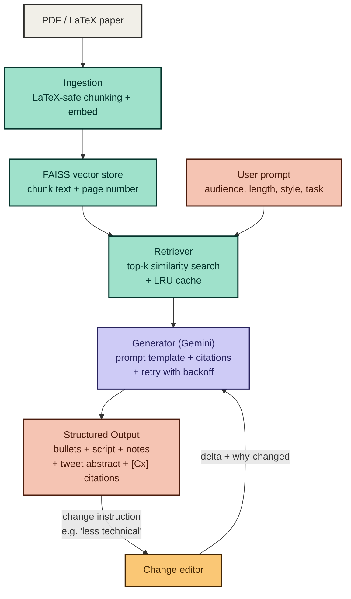

# SARAL Chatbot — Audience-Adaptive Script & Bullet Generator

A retrieval-augmented generation (RAG) prototype for SARAL that turns a research
paper into audience-adapted scripts, slide bullets, speaker notes, tweet-sized
abstracts, and short summaries — with inline provenance citations and iterative,
change-tracked editing.

Built for the SARAL recruitment assignment (Part A: Programming Task).

## What it does

Given a research paper (PDF) and a request like *"make a 90-second script for
policymakers"*, the system:

1. **Retrieves** the most relevant passages from the paper using semantic search
2. **Generates structured output** parameterized by **audience** (policymakers /
   grad students / press), **length** (30s / 90s / 5min), and **style**
   (technical / plain-English / press release):
   - **Slide-level bullets** — concise, slide-ready points
   - **Full speaker script** at the requested length
   - **Speaker notes** (3 per section) with presenter tips
   - **Tweet-sized abstract** (≤280 chars) for quick sharing
3. **Tags every factual claim** with a citation (`[C12]`) linking back to the
   exact source chunk and page number
4. **Preserves LaTeX/math notation** inline (e.g. `$F1 = \frac{2 \cdot Pr \cdot Re}{Pr + Re}$`)
5. Supports **iterative editing** — e.g. *"make #2 less technical"* — and shows a
   **diff of what changed and why**, instead of silently replacing the output

## Architecture



**Pipeline stages:**

- **Ingestion** (`ingest.py`) — Extracts text per page using PyMuPDF, chunks it
  while protecting LaTeX math blocks (inline `$...$`, display `$$...$$`, and
  `\begin{equation}` blocks) from being split mid-expression, embeds chunks with
  `sentence-transformers` (`all-MiniLM-L6-v2`), and stores them in a FAISS index
  along with page-number metadata. Validates input (file existence, extractable
  text) and raises clear errors for empty/corrupted PDFs.

- **Retrieval** (`retrieve.py`) — Embeds the user's query and runs top-k cosine
  similarity search over the FAISS index, returning chunk text, page number, and
  similarity score for each match. Includes **LRU result caching** (keyed on
  query + k + boost_math) to avoid redundant embedding + FAISS search during
  iterative editing sessions, with observable cache-hit/miss statistics.

- **Generation** (`generate.py`) — Builds a parameterized prompt (audience,
  length, style) from the retrieved chunks and calls Gemini with **automatic
  retry and exponential backoff** for transient API errors (rate limits, network
  timeouts, 5xx). Parses the output into **structured sections** (slide bullets,
  speaker script, speaker notes, tweet abstract) with graceful fallback if the
  model doesn't follow the format. Also implements `apply_change()` for iterative
  edits: it re-generates the targeted section, computes an old-vs-new diff with
  `difflib`, and asks the model for a short "why changed" explanation.

- **Evaluation** (`eval.py`) — Computes citation coverage (the percentage of
  output lines carrying a `[Cx]` tag) and a factuality proxy (the average cosine
  similarity between each generated sentence and the source chunk it cites).
  Reuses the cached embedding model from the retriever to avoid redundant loads.

- **UI** (`app.py`) — A polished Streamlit interface with:
  - **PDF upload** with automatic indexing
  - Audience, length, and style parameter controls
  - **Structured output cards** (bullets, script, notes) with citation badges
  - **Tweet-sized abstract** display with character counter
  - **Inline diff highlighting** (colored additions/deletions) for change-tracking
  - **Provenance panel** showing retrieved source chunks with scores
  - Conversation logging

## Setup

```bash
pip install -r requirements.txt
```

Create a `.env` file (see `.env.example`) with your Gemini API key:
```
GEMINI_API_KEY=your_key_here
```
Get a free key at [aistudio.google.com/apikey](https://aistudio.google.com/apikey).

## Usage

**1. Ingest a paper:**
```bash
python ingest.py --pdf data/sample_paper.pdf --out data/index
```

**2. Test retrieval directly (optional sanity check):**
```bash
python retrieve.py --index data/index --query "methodology used" --k 3
```

**3. Generate a structured script/bullets/notes:**
```bash
python generate.py --index data/index \
  --audience "grad students" --length 90s --style technical \
  --instruction "Summarize the methodology used"
```

**4. Run automatic evaluation (single paper):**
```bash
python eval.py --index data/index \
  --audience "grad students" --length 90s --style technical \
  --instruction "Summarize the methodology used"
```

**4b. Run automatic evaluation across multiple papers (comparison table):**
```bash
python eval_multi.py --papers data/paper1.pdf data/paper2.pdf data/paper3.pdf \
  --instruction "Summarize the methodology used" \
  --audience "grad students" --length 90s --style technical
```

**4c. Run unit tests (chunking, math-preservation, citation extraction, structured parsing):**
```bash
pip install pytest
pytest test_pipeline.py -v
```

**5. Launch the chat UI:**
```bash
streamlit run app.py
```

**6. See iterative change-tracking end to end:**
```bash
python test_change.py
```

## Example run

Paper used: a landslide susceptibility assessment (LSA) research paper (11 pages,
included at `data/sample_paper.pdf`).

**Input:** audience=grad students, length=90s, style=technical, task="Summarize
the methodology used"

**Output (excerpt):**
> **Slide Bullets:**
> - LCFSTE integrates Landslide Conditioning Factors with a Swin Transformer
>   Ensemble for susceptibility mapping [C1]
> - Model evaluated via Matthews Correlation, Precision, Recall, F1 Score [C71]
>
> **Speaker Script:**
> Landslide susceptibility assessment (LSA) is a predictive tool used to estimate
> the likelihood of landslides occurring in a specific area based on local
> conditions [C13]. A key methodology developed for this task is LCFSTE, which
> integrates Landslide Conditioning Factors and a Swin Transformer Ensemble [C1]...
>
> **Tweet Abstract:**
> New study introduces LCFSTE — a deep learning framework combining Swin
> Transformers for landslide susceptibility mapping, outperforming traditional
> methods on three study areas.

**Change instruction:** "make this less technical for a general audience"

**Result:** the system regenerated the section in plain English (e.g. "Landslide
susceptibility assessment (LSA) is a way to predict where landslides are most
likely to happen..."), produced a unified diff of the exact lines that changed,
and explained: *"The AFTER text replaced complex academic jargon and statistical
modeling terms with simplified, plain-English descriptions to make the technical
concepts of landslide prediction more accessible."*

Full conversation log: [`logs/conversation_example.md`](logs/conversation_example.md)

## Evaluation results

Run on 3 test papers (per the brief's "small test set (3 papers)" requirement),
with instruction="Summarize the methodology used", audience=grad students,
length=90s, style=technical:

| Paper | Citation coverage (%) | Factuality proxy (avg similarity) | Sentences checked |
|---|---|---|---|
| paper1 (landslide susceptibility) | 100.0% | 0.558 | 9 |
| paper2 | 100.0% | 0.595 | 9 |
| paper3 | 100.0% | 0.606 | 8 |
| **Average** | **100.0%** | **0.586** | — |

**What these numbers mean:**
- **Citation coverage (100%)** — every non-empty output line carries at least
  one `[Cx]` provenance tag, consistently across all 3 papers.
- **Factuality proxy (~0.55-0.61)** — average cosine similarity between each
  generated (cited) sentence and the source chunk it cites. This is expected
  to be well below 1.0 even for fully grounded, accurate text, since the model
  paraphrases rather than copying verbatim; scores in this range indicate the
  generated claims stay semantically close to their cited source.

**What's not included, and why:** ROUGE/BERTScore against a human-authored
reference script, and 3-rater human evaluation for audience-appropriateness,
factuality, and helpfulness, are specified in the brief but require a
human-written reference script and human annotators — both out of scope for a
1-day prototype. The natural next step would be to collect 1-2 human-written
reference scripts per test paper and run BERTScore against them, plus a small
(3-rater) blind rating pass on a handful of generated outputs.

## Design notes & trade-offs

- **Embeddings:** `sentence-transformers/all-MiniLM-L6-v2` (open, local, free) —
  chosen over an API-based embedding model to keep the pipeline runnable
  offline/cheaply for a small conference-paper-sized corpus, per the brief's
  "use small conference papers to avoid excessive cost" guidance.

- **Generator:** Gemini (`gemini-2.0-flash`) via API — fast and free-tier
  friendly for a 1-day build; the prompt template is model-agnostic and could
  be swapped to an open 7B model or another API with no pipeline changes.
  Includes **automatic retry with exponential backoff** for transient errors
  (rate limits, 5xx, timeouts) and graceful handling of content-filtered
  responses.

- **Structured output:** The prompt template requests four labeled sections
  (`## Slide Bullets`, `## Speaker Script`, `## Speaker Notes`,
  `## Tweet Abstract`). A parser splits the response on these headers with a
  graceful fallback — if the model doesn't produce the expected structure, the
  full text is treated as a speaker script so nothing is lost.

- **Scalable architecture — retrieval caching:** The `Retriever` class uses an
  LRU cache (128 entries) keyed on `(query, k, boost_math)` to skip redundant
  embedding and FAISS search during iterative editing sessions where the user
  refines the same query. Cache hit/miss statistics are exposed via
  `Retriever.cache_stats()` for observability.

- **Math-aware retrieval (implemented, not just proposed):** this is the exact
  improvement proposed for SARAL in Part B — chunks containing LaTeX/math
  blocks get a retrieval-score bonus whenever the user's instruction implies
  equations matter (e.g. mentions "equation", "formula", "preserve the math").
  See `retrieve.py`'s `Retriever.search(..., boost_math=True)` and
  `instruction_wants_math()`; `generate.py` triggers it automatically. Verified
  end-to-end: asking to "explain the precision and recall equations" reliably
  retrieves the exact chunks containing those formulas and preserves them
  inline in the output (e.g. `$Pr = \frac{TP}{TP + FP}$`).

- **Error handling:** Input validation at every boundary (missing files, empty
  PDFs, zero chunks, missing API key, API failures, malformed LLM output).
  Errors surface as clear messages in both CLI and UI rather than raw tracebacks.

- **Retrieval quality depends on query specificity.** A generic query (e.g.
  "what is the main contribution?") can retrieve boilerplate sections like
  author bios, since those also use generic academic language. Domain-specific
  queries retrieve content-relevant chunks reliably (verified during testing —
  see conversation logs).

- **Safety/style constraints** are enforced via explicit system-prompt
  instructions (avoid offensive language, match requested accessibility level)
  rather than a separate classifier, given the time budget — a dedicated
  toxicity/accessibility classifier is a natural hardening step for production.

- **Testing:** `test_pipeline.py` covers the pure-logic parts (math-block
  protection/restoration surviving a round trip, chunking never splitting a
  math expression across a boundary, citation-tag extraction and coverage,
  structured output parsing and fallback, edge cases for empty inputs) without
  requiring model downloads, so it runs in under a second and can be used as a
  fast regression check after any change (16 tests).

## Citations / external resources used

- Lewis et al., *Retrieval-Augmented Generation for Knowledge-Intensive NLP
  Tasks*, NeurIPS 2020 — [arXiv:2005.11401](https://arxiv.org/abs/2005.11401)
  (RAG design reference)
- `sentence-transformers` / `all-MiniLM-L6-v2` — open embedding model
- Google Gemini API — generation
- FAISS — vector similarity search
- Streamlit — UI
- PyMuPDF — PDF text extraction